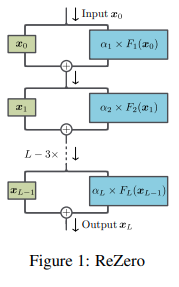
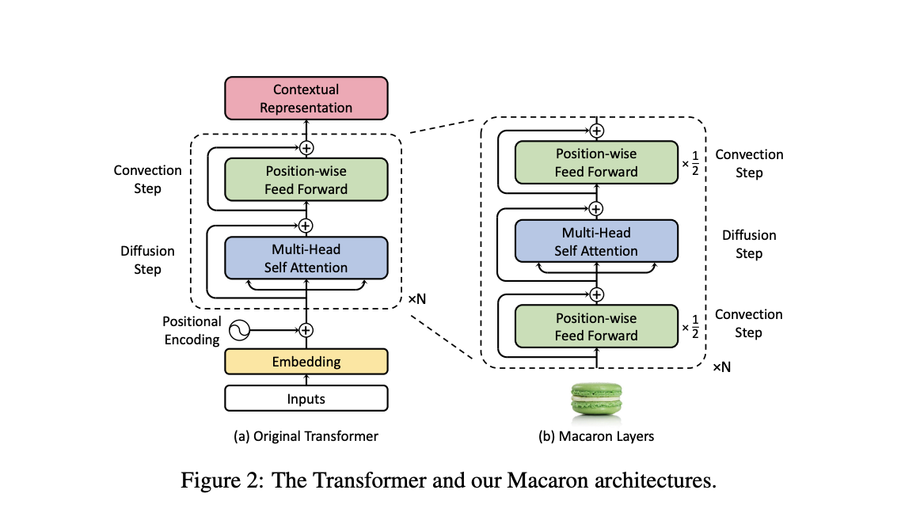

# Pytorch GPT-X
My Own Pytorch GPT-X 

## 1. Abstract
Train GPT-3 model on V100(16GB Mem) Using improved Transformer. 

## 2. Model
### Transformer
### Additional Module
#### ① Rezero
Rezero Is All You Need [link](https://arxiv.org/abs/2003.04887)


#### ② Explicit Sparse Transformer
Explicit Sparse Transformer: Concentrated Attention Through Explicit Selection [link](https://arxiv.org/abs/1912.11637)


#### ③ Macaron Architecture
Understanding and Improving Transformer
From a Multi-Particle Dynamic System Point of View [link](https://arxiv.org/pdf/1906.02762.pdf)


#### ④ RealFormer, Residual Attention
RealFormer [link](https://arxiv.org/abs/2012.11747)


## Train
### DeepSpeed
DeepSpeed is a deep learning training optimization library, providing the means to train massive billion parameter models at scale.
```
pip install deepspeed
```
> To use ZeRO, you must use precision=16.
#### Example
##### 1. ZeRO Stage 2 - Shard optimizer states and gradients, remains at parity with DDP with memory improvement
```
from pytorch_lightning import Trainer

model = MyModel()
trainer = Trainer(gpus=4, plugins="deepspeed_stage_2", precision=16)
trainer.fit(model)
```
##### 2. ZeRO Stage 2 Offload - Offload optimizer states and gradients to CPU. Increases communication, but significant memory improvement
- Basic usage
```
from pytorch_lightning import Trainer
from pytorch_lightning.plugins import DeepSpeedPlugin

model = MyModel()
trainer = Trainer(gpus=4, plugins="deepspeed_stage_2_offload", precision=16)
trainer.fit(model)
```

- More speed benefit
```
import pytorch_lightning
from pytorch_lightning import Trainer
from pytorch_lightning.plugins import DeepSpeedPlugin
from deepspeed.ops.adam import DeepSpeedCPUAdam


class MyModel(pl.LightningModule):
    ...

    def configure_optimizers(self):
        # DeepSpeedCPUAdam provides 5x to 7x speedup over torch.optim.adam(w)
        return DeepSpeedCPUAdam(self.parameters())


model = MyModel()
trainer = Trainer(gpus=4, plugins="deepspeed_stage_2_offload", precision=16)
trainer.fit(model)
```

##### 3. ZeRO Stage 3 - Shard optimizer states, gradients, (Optional) activations and parameters. Increases communication volume, but even more memory improvement
##### 4. ZeRO Stage 3 Offload - Offload optimizer states, gradients, (Optional) activations and parameters to CPU. Increases communication, but even more signficant memory improvement.
  
## TODO

- [x] ~~ReZero~~
- [x] ~~RealFormer, Residual Attention~~
- [x] ~~Macaron architectures~~
- [x] ~~Macaron architectures - layer Scale 0.5~~
- [x] ~~Explicit Sparse Transformer~~
- [ ] torch lightning
- [ ] Deepspeed train on single GPU
- [ ] Deepspeed parallel trainig on 2 V100 GPU with 16GB Memory

## Parameter For Few-shot
The 175B parameter model is very large, but a large model is needed for Few-Shot Learning.
So this repository try to use DeepSpeed for training extremely big model.


## GPT-3 Config
|   model_name    |n_params | n_layer | d_model | n_heads | d_head | batch_size | learning_rate |
|:---------------:|---------|---------|---------|---------|--------|------------|---------------|
|   GPT-3 175B    |  175B   |    96   |  12288  |    96   |   128  |    3.2M    |   0.6 x 10^-4 |
|   GPT-3 13B     |  13B    |    40   |  5140   |    40   |   128  |     2M     |   1.0 x 10^-4 |
|   GPT-3 6.7B    |  6.7B   |    32   |  4096   |    32   |   128  |     2M     |   1.2 x 10^-4 |
|   GPT-3 2.7B    |  2.7B   |    32   |  25560  |    32   |   80   |     1M     |   1.6 x 10^-4 |

# References
**Transformer**

- [lucidrains/x-transformers](https://github.com/lucidrains/x-transformers)
  
**DeepSpeed**

- [DeepSpeed](https://www.deepspeed.ai/)
- [DeepSpeed Core API Doc](https://deepspeed.readthedocs.io/en/latest/index.html)

**ReZero**

- [/majumderb/rezero](https://github.com/majumderb/rezero/blob/master/rezero/transformer/rztx.py)

**Explicit Sparse Transformer**

- [x-transformer: explicit_sparse_transformer](https://github.com/lucidrains/x-transformers/blob/2badf9261cda03e1497b5db62274b045cd827086/x_transformers/x_transformers.py#L469)

**Macaron Architecrue**

- [Understanding and Improving Transformer From a Multi-Particle Dynamic System Point of View](https://arxiv.org/pdf/1906.02762.pdf)

**RealFormer Residual Attention**
- [cloneofsimo/RealFormer-pytorch](https://github.com/cloneofsimo/RealFormer-pytorch/blob/main/models.py)

**DeepSpeed**
- [PyTorch lightning DeepSpeed](https://pytorch-lightning.readthedocs.io/en/stable/advanced/advanced_gpu.html#deepspeed)